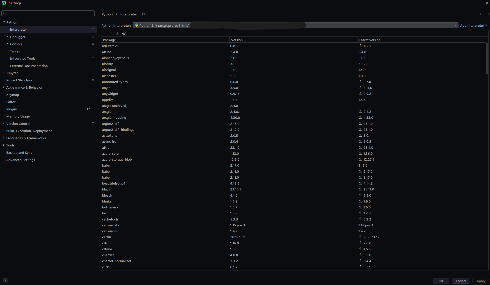

# _Network Datasets with ArcPy_
by Aaron Rumph | Read Me Last Updated: 11/17/25
## About
### Easily Create Network Datasets with Open Data!
This repository contains a few modules that allow for creating network datasets automatically with ArcPy 
using OpenStreetMap data (courtesy of osmnx). At the moment, you can create network datasets for any place
(was designed with cities in mind, but can also do counties or any place that Nominatim will recognize, so maybe 
neighborhoods or zip codes) in the world if doing place_only or specified for geographic scope (see How to Use). 
If you would like, you can also create a network dataset for the entire county, MSA, or CSA a place is in, provided
it is in the U.S. (see _How to Use_). At the moment, the only network types that are supported are "walk" 
and "transit" (see _How to Use_), with both using pedestrian network data from OSM. Currently, if transit is selected, 
the transit network dataset will automatically query the TransitLand API for transit data for the place and use the GTFS
data found for that place to create the network dataset. I am working on a "bring your own" feature, so that you can 
use your own transit data to create a transit network dataset, however for the moment, be warned that 1) the transit 
data will automatically be found and used and 2) at the moment, only the original input place is used to find the 
transit data (see _How to Use_ and _Current Known Issues_), so if you give it a place like "San Francisco" it will work,
but "Kensington, CA, USA" will likely turn up no results for transit data. As such, I recommend using the largest place 
possible (i.e., while it will be able to generate a network dataset for the CSA that Kensington (Bay Area) is in, 
it will not be able to find the transit data for Kensington, so I recommend using San Francisco as your input place
instead. It's the same CSA either way, but this way you'll get transit data for every agency that serves SF). 

Also, fair warning, while I have tried to optimize my code as much as possible, it may still take a while to run.
There's only so much I can do. Though I'd like to think I'm not horrible at programming, I'm sure I've done some stupid
things. ArcPy tends to be pretty slow (so whenever possible, I've tried to avoid using it). Also, the sheer amount of 
data used in creating a network dataset (particularly if you're using elevation data or if you're doing CSAs or MSAs)
means it's just going to take a while no matter what. 

The goal of this readme is to make my code accessible to others, primarily planning students/planners. As such, not much
technical knowledge (at least when it comes to Python, ArcGIS on the other hand...) is presumed. If you have lots of 
experience working with Python (or any other programming language), you may want to skip the _IDE Set Up_ section. 

#### To give a sense here are some (pretty accurate) estimated runtimes for various scenarios based on my own experiments:

- Berkeley, CA city limits, elevation enabled walking network dataset (10,000 nodes, 30,000 edges): 2.5 minutes
- San Fransisco, CA city limits, elevation enabled walking network dataset: (80,000 nodes, 250,000 edges): 20 minutes
- San Fransisco, CA city limits, elevation enabled transit network dataset: (80,000 nodes, 250,000 edges): 45 minutes
- San Francisco, CA CSA, no elevation transit network dataset: (1,000,000 nodes, 4,000,000 edges): 1 hour
- Chicago, IL city limits, no elevation walking network dataset: (300,000 nodes, 1,000,000 edges): 5.5 minutes

### Generate Isochrones from Addresses or Coordinates!
Additionally, this repository allows you to create isochrones from addresses or coordinates with network datasets 
created as described above (see _How to Use_). I have made some attempts to make this as user-friendly as possible, 
so I would say go with 
the default parameters for the most part, but there is a lot to customize if you would like to! Also, I mostly added 
this feature as a way of showing off my code to others without having to open ArcGIS (I have, only half-jokingly, 
said that my goal is to never have to open ArcGIS and do anything manually again) so feel free to use it as you see fit!
I have made some editorial decisions around what the default parameters are, like choosing what I think is the best 
color-scheme for isochrones, what the default cut-offs should be etc., but go wild!

## Set Up
### Most Important Bit
Before you can run any of my code, you need three things: 

### 1) **A working Python IDE you can actually run the code in.**

Any IDE will do just fine, but I am partial to Pycharm. You could run it straight in the command line,
but I would not recommend it because harder to find documentation for my code. Also, theoretically, you could run
it straight in the Python window in ArcGIS Pro, but I am not sure how that would work with it split up into modules.

### 2) **ArcGIS Pro and the associated Python environment that Esri provides (Most Important of the Three!).**
    
Because ArcGIS is closed source, ArcPy is also closed source, so when you try to use it, Esri will check that you 
have a valid license and access to the necessary extensions (in this case, just Network Analyst). To do this, they 
make you use the environment they provide (or a clone of it) to do anything with ArcPy. Now, because running this 
code involves using packages that are not included in the standard arcgispro-py3 environment, you will need to 
clone the environment that ArcGIS Pro provides. To do this, you can either go to options in ArcGIS Pro proper, and
clone it there, or you can use the Python Command Prompt that comes with ArcGIS (can just search 
"Python Command Prompt" in start menu) and enter:
        
        conda create --name arcgispro-py3-nd-clone --clone arcgispro-py3
##### If you are planning to use the command line to run the code, you will need to activate the environment before running the code. To do this, enter:
        
        conda activate arcgispro-py3-nd-clone
Also, you will need to install the required packages for this project that don't come already installed in the clone
(see _Requirements.txt_). Make a note of the path to your environment as you'll need it to set up the interpreter in 
the IDE.

##### If you are using an IDE to run the code:
You will need to set up the environment in the IDE to use the cloned environment. 
This will vary depending on the IDE you are using, but pretty straightforward in most cases 
(if not, use Google/Bing/Your IDE's Documentation/AskJeeves), or see below.

**If you do not know how to do this, and are using an IDE for the first time, see _IDE Set Up_ section below**

Now, you should be set up to use ArcPY!
    

### 3) **API Keys**
You will need API keys for exactly two things. First, if you would like to use the transit network dataset feature, 
you will need an API key for the TransitLand API (can be gotten for free [here](https://www.transit.land/documentation/index#sign-up)).
Second, no matter what, 
you will need an API key for the Census Bureau API from [here](https://api.census.gov/data/key_signup.html) 
(I guess not if you only do place_only for geographic scope, 
but trust me you want one, and it's free). 

Once you have those two API keys, make a .env file (I would recommend calling it api_keys.env, and putting it in the
same directory as the rest of the code because that is what the code is already set up for, but if you would like, you 
can configure it however you like to configure your .env files) and add the following lines:

    TRANSITLAND_API_KEY=your_transitland_api_key_here
    CENSUS_BUREAU_API_KEY=your_census_bureau_api_key_here

**Note, if you are new to .env files, make sure that there are no spaces around the equals sign** 
_(yes, this did trip me up, how could you tell)_.

Finally, for geocoding with Nominatim's API, you will need to use a user agent (see Nominatim's policy 
[here](https://operations.osmfoundation.org/policies/nominatim/) 
You don't need to sign up for anything,
just pick a name that you feel best describes your use case and use that. Then, you must add it to your api_keys.env
(or equivalent) file with

    NOMINATIM_USER_AGENT=your_user_agent_here
Also note that if you use spaces, you should use quotes around your user agent. For example:

    NOMINATIM_USER_AGENT="Your User Agent Here"

### IDE Set Up and Downloading Code (skip if familiar)
The easiest way to play around with my code is just to clone it from this GitHub repository and then import it into your
IDE. If you already have an IDE, I'm going to assume you know how to do this. If not, I would recommend PyCharm as your 
IDE because it's free and is just what I use (you can download it [here](https://www.jetbrains.com/pycharm/download/?section=windows)).

**Once you've downloaded and installed PyCharm, you should see a screen that looks like this:**

Now, you can just hit the _Clone Repository_ button in the top right, and enter the following URL:
        
    https://github.com/aaronrumph/transit_network_datsets_with_ArcPy

Then, you can just hit the _Clone_ button, and you will now have a copy of the files necessary to play around with my 
code! Now, you need to configure the project to use the right interpreter. If you have not already done the steps 
explained in item 2) in the _Set Up_ section, you will need to do that now. Now, hit ctrl+alt+s to open the settings, 
and then navigate to _Python_ and then under that, _Interpreter_. Now, you should see a window that looks like 

Click _Add Interpreter_, and then _Local Interpreter_. Then, click _Select existing_, and 
navigate to the path to your cloned argispro-py3 environment that you created in item 2) of the _Set Up_ section
(arcgispro-py3-nd-clone). By default, your path should be something like:

    ...Users\<your_name>\AppData\Local\ESRI\conda\envs\arcgispro-py3-nd-clone\python.exe"

You can then set that as your interpreter and after it loads, you should be good to go!

## How to Use
Honestly, the best thing to see how it works (as frustrating as it sounds), is just to play around with it, and read the
documentation for the Classes, methods, and functions. My suggestion, is to run the code_playground.py file,
and play around with the starting defaults I've provided to see how it works. 

If, however, you don't have time for that, simply create a ArcProject object:

    your_arcgis_project = ArcProject(name="demonstration", project_location="dir_where_the_project_folder_will_go")

and a Place object:
    
    your_place = Place(arcgis_project=your_arcgis_project, place_name="San Francisco", geographic_scope="place_only")

and then call the create_network_dataset_from_place method:
    
    your_place.create_network_dataset_from_place(network_type="walk", use_elevation=False)

or the generate_isochrone method:
    
    your_place.generate_isochrones_from_place(isochrone_name="demonstration_isochrone, addresses=[your_addr_1, your_addr_2], points=[your_point_1, your_point_2], 
                                              network_type="walk", use_elevation=False)

## Features

#### 1) Create Network Datasets using free, open data!
 - Create walking or transit network datasets for various geographies
 - Create network datasets for a bounding box
 - Create network datasets that take elevation into account

#### 2) Generate Isochrones using the Network Datasets
- Generate isochrones from addresses 
- Generate isochrones from points

## Development Process
Nothing to see here yet, sorry!

## Current Known Issues

- If, when trying to create transit network dataset, you give a place that doesn't return any agencies 
  from TransitLand's API, it will crash and burn when it doesn't find any.
- At the moment, only looks for transit agencies that serve the main place given, not all in the CSA, MSA, or county
- Color ramp for isochrones is opposite of what I would like (darker means less time rather than lighter means less time)

## Eventual Goals
Somethings I would like to add/change about this code:

### Open Source!
At the moment, my code uses ArcPy, which is great in that it's easy and Esri gives you a lot of very powerful tools 
fresh out of the box. That said, there are two problems: first, you have to have an ArcGIS Pro license 
(expensive) as well as access to the Network Analyst extension; second, while it is nice not having
to write all the code for creating a network dataset (which is just a fancy graph) myself, Esri's code is
not exactly the fastest or best at times.

As such, I hope to eventually do all of that stuff myself. Fortunately, there are many, many other people
who are committed to/working on open source transportation network stuff, and I hope to expand on their work!
Some of this stuff already exists and it's just a matter of adapting it for this use case (e.g., there 
are a million implementations of Dijkstra's to use for shortest path), whereas some of it will require lots
of work to create a solution from scratch (e.g., I have not come across any open source algorithms
that can create graphs that represent a transit network based on GTFS data). 

### Other Network Analysis Tools
For now, the only two features I have are creating network datasets and generating isochrones,
and while these are all well and good, I would like to (and indeed, need to, for a project I'm working
on for class) add support for Origin-Destination Cost Matrices, Shortest Path Routing, and more.

### Other Network Types
Unfortunately, my code in its current form only allows for the creation/use of transit and walking
network datasets. When I have some more time, I would love to add support for driving and biking 
(and biking + transit).

### Bring Your Own GTFS Data/Improved Transit Networks
As mentioned previously, when building a transit network dataset at the moment,
you can only use the automatically retreived GTFS data for the specified place.
I would like to, and should soon, add the ability to _'bring your own'_ GTFS data
to use in building the transit network dataset. My goal is to make the user
interface for this as friendly as possible, so that it is usable by other people.

Additionally, I would like to fix the current behavior where it only gets the transit
agencies that serve the 'core' place rather than the entire selected geographic scope.

### A CLI/GUI
Long term, I would like to create a GUI or CLI that I can distribute to people so that 
they can use this code *without* having to install an IDE, or clone their
arcgispro-py3 env themself. This may be dependent on the Open Source goal,
as otherwise it'd be a mess of permissions (especially with ArcGIS/Esri), 
but I believe it's the ultimate long term goal. 